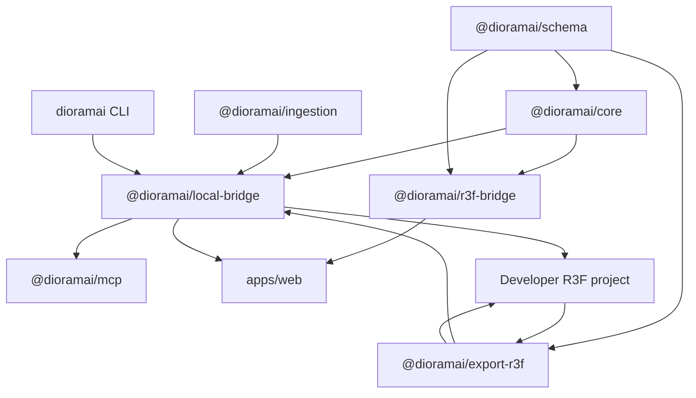

# Architecture Overview

Dioramai separates canonical scene state, runtime projection, and generated code.
Its MVP is a local live-sync loop for React Three Fiber projects.

## Product Boundary

Dioramai is a visual runtime orchestration layer for R3F applications. It is not
a renderer, cloud publisher, model generator, browser game engine, or general
3D editor. It operates after assets exist in a developer repository and before
the resulting R3F application is deployed through that repository.

## Source Of Truth

The canonical source of truth is the Zod-validated Dioramai scene document:

- `@dioramai/schema` defines scene documents, nodes, transforms, asset refs,
  semantics, behaviors, validation, and stable JSON serialization.
- `@dioramai/core` applies commands through a pure deterministic reducer.
- Runtime objects, R3F refs, TransformControls state, camera state, command
  timeline UI, and Zustand app state are projections or controls only.

Persistent scene edits must flow through commands:

```text
R3F pointer/transform interaction
  -> @dioramai/r3f-bridge command translation
  -> @dioramai/core reducer
  -> canonical scene
  -> @dioramai/export-r3f generated module
  -> app/runtime refresh
```

## Package Model



## `@dioramai/schema`

- Owns the `dioramai-scene` document wrapper and scene graph validation.
- Preserves stable node IDs, hierarchy, transforms, visibility, `assetRef`,
  semantic groups, behaviors, and asset records.
- Provides deterministic `serializeScene` and parse/migration helpers.

## `@dioramai/core`

- Owns the command union and `applyCommand` reducer.
- Commands include node CRUD, transform updates, semantic metadata,
  `REGISTER_ASSET`, `REPLACE_SCENE`, and selection.
- Core has no React, no Zustand, no file IO, and no R3F refs.

## `@dioramai/r3f-bridge`

- Projects canonical scene nodes into R3F groups/components.
- Maintains a runtime node registry keyed by stable Dioramai node IDs.
- Translates selection and TransformControls commits into commands.
- Provides inspector helpers derived from schema state.
- Does not own canonical state, write files, or expose runtime refs as
  canonical data.

## `@dioramai/export-r3f`

- Emits deterministic R3F fragments/modules from canonical scenes.
- Emits the MVP sync module format with an embedded `dioramaiScene` document.
- Parses the embedded scene block back into validated canonical state.
- Does not emit editor-only state, command logs, filesystem paths, or runtime
  refs.

## `@dioramai/local-bridge`

- Owns the local repo boundary, file watching, generated module writes, local
  asset serving, and project path validation.
- Is the only filesystem-aware, repo-aware, and asset-aware P0 layer.
- Exposes only the safe runtime sync tools needed for local code/runtime sync.
- Binds to localhost and requires a bridge pairing token for browser-origin
  requests.

## `apps/web`

- Runtime debug shell: viewport, hierarchy, inspector, code preview, sync
  status, and local GLB registration UI.
- Uses Zustand only for app/view/session state.
- Transform edits call the local bridge `update_transform` tool when connected;
  the shell never owns GLBs, project files, or persistence.

## Agent And MCP Surface

The MVP tool surface is intentionally narrow:

- `load_scene`
- `get_scene`
- `register_asset`
- `update_transform`
- `export_r3f`
- `sync_code`

MCP operates through `@dioramai/local-bridge`. It must not access the filesystem
directly, start generation workflows, run shell commands, evaluate JavaScript,
touch Zustand state, or expose R3F/Three objects.

## Deferred Packages

`@dioramai/agent-interface`, `@dioramai/generation`, and
`@dioramai/generation-meshy` are retained only as deferred historical
experiments. They are not part of the P0 runtime-sync bridge, root scripts, or
MCP tool path.
