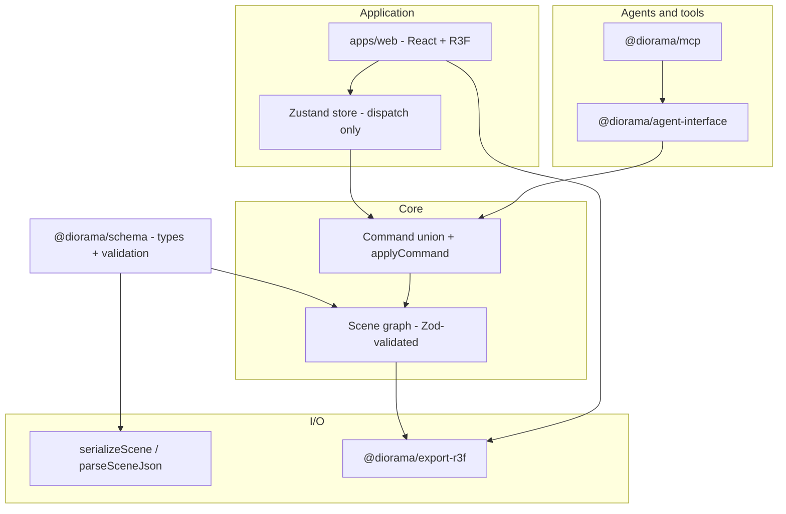
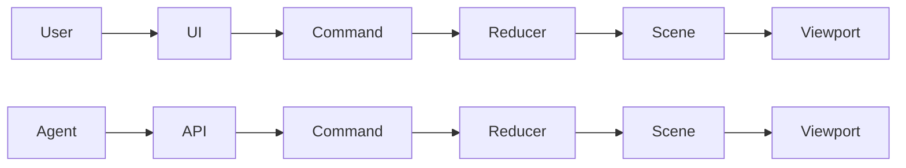

# Architecture overview

Diorama separates **canonical scene state**, **how it changes**, and **how it is shown or exported**. The goal is a small, testable core with clear boundaries.

Diorama is a control layer between spatial data, code, and AI systems.

## System Boundary

Diorama treats scene state as structured data plus deterministic
transformations. The scene graph is the model. React Three Fiber is not the
model; it is a render layer that visualizes the model.

- **Scene graph vs render layer**: `Scene` and `SceneNode` data define hierarchy,
  transforms, visibility, refs, and metadata. R3F objects are derived render
  artifacts and must not become canonical state.
- **Commands vs UI interaction**: UI gestures, inspector edits, outliner actions,
  agent requests, and future MCP calls must compile to commands. Commands are
  the only path for persistent scene mutation.
- **Control layer**: Diorama sits between spatial data, generated/exported code,
  and AI systems so each interface uses the same validated scene and command
  contracts.

## Layered model

## `@diorama/schema`

- Defines canonical version 2 `Scene` documents, `SceneNode`, local transforms,
  optional asset/material/light fields, and JSON-safe metadata.
- Validates graph invariants: single root, root node type, no non-root root
  nodes, no cycles, no orphans, consistent `children` references, and valid
  selection.
- Provides `serializeScene` / `parseSceneJson` (including v1 and bare legacy
  migration where supported) and `stableStringify` for deterministic JSON.
- Exports only wrapped version 2 documents: `format`, `version`, and `data`.

## `@diorama/core`

- **`Command`** - Discriminated union (`ADD_NODE`, `DELETE_NODE`, `UPDATE_TRANSFORM`, `SET_PARENT`, `DUPLICATE_NODE`, `ARRANGE_NODES`, `REPLACE_SCENE`, `SET_SELECTION`).
- **`applyCommand(scene, command)`** - Pure, deterministic reducer entry point.
- **Fixtures** - `getStarterScene` and static scenes for tests and the web kits UI.
- **Layout** - Helpers such as `ARRANGE_NODES` for grid-like positioning.

No React imports in core. Three.js math is allowed in core only for TRS
composition/decomposition that serves command semantics, as documented in ADR
010. Core remains renderer-independent even though it uses Three.js math types.

## `apps/web`

- Visual adapter over canonical scene state. The canvas is not a source of
  truth.
- Renders the scene graph recursively from `scene.rootId`.
- Renders each node, including the root, as an R3F `group` with that node's local
  transform. Non-identity root transforms are supported and must be reflected in
  the viewport.
- User actions dispatch commands through the scene store; UI code must not
  rewrite `scene.nodes`, transforms, child arrays, or selection directly.
- Import/export and Load kit use the same schema and command paths as automation
  would.
- Viewport traversal must match export traversal: hierarchy follows `children`
  order and hidden nodes skip their descendants.
- `SET_SELECTION` updates canonical selection but is omitted from the primary
  visible command log.
- `REPLACE_SCENE` is a session boundary in the web store: scene replacement
  resets gizmo mode, undo, redo, coalescing state, and command log.

## `@diorama/export-r3f`

- Consumes a validated `Scene` and emits deterministic, readable JSX strings
  suitable for R3F apps.
- Kept separate so export behavior is tested independently of the web UI.
- Must match scene hierarchy/local transform semantics and must not emit
  UI-only state.
- Emits visible nodes as nested `<group>` elements, primitive mesh placeholders
  for `mesh` nodes, and simple ambient/directional lights for scene light nodes.
- Also exposes a structured React module bridge with semantic component
  mapping and behavior scaffolds; see [R3F_BRIDGE.md](R3F_BRIDGE.md).
- Omits hidden nodes and their descendants.
- Does not resolve assets, material graphs, animation, shader graphs, glTF, or
  full renderer semantics.

## `@diorama/agent-interface`

- Agent-ready internal runtime for scene reads, selection reads, command dry-run,
  command apply, batch dry-run/apply, scene load, scene export, and deterministic
  action log reads.
- Schemas and types for sessions, commands, command batches, load-scene inputs,
  and export inputs so agents produce **validated** payloads before they hit
  `applyCommand`.
- Imported scenes must be parsed/migrated to canonical version 2 before commands
  run.
- Does not expose filesystem access, shell execution, arbitrary JavaScript
  execution, Zustand state, or R3F objects.
- Undo/redo are deferred for the agent runtime; command batches and scene loads
  are the locked Milestone 6 mutation surface.

## `@diorama/mcp`

- Thin integration layer for MCP hosts; currently re-exports
  `@diorama/agent-interface`.
- Full MCP remains deferred and must wrap the same version 2 scene and command
  contracts.
- Future MCP tools must wrap the agent runtime and must not connect directly to
  Zustand or invent a second mutation path.

## `@diorama/examples`

- Contains static JSON examples, scripts, and docs-driven demos. Checked-in
  scene JSON should stay byte-for-byte aligned with canonical starter scene
  serialization.
- Example scenes are export fixtures for JSON reloadability, stable ordering,
  required v2 fields, and R3F snapshot coverage.

## Data flow

Text equivalent:

- User -> UI -> Command -> Reducer -> Scene -> Viewport
- Agent -> API -> Command -> Reducer -> Scene -> Viewport
- Cursor/Claude -> local Diorama MCP server -> Diorama commands -> live canvas
  -> export code

1. A human UI action or agent API request builds a `Command` or command sequence.
2. The command is validated at the boundary that receives it.
3. The reducer applies the command deterministically to the canonical `Scene`.
4. The viewport reflects the updated scene graph.
5. Export and serialization read the same updated scene.
6. Exported JSON can be parsed back into canonical scene state; exported R3F is
   a deterministic code view of that state.

This keeps **replay**, **testing**, and **tooling** aligned on one semantic model.

See [AGENT_API.md](AGENT_API.md) for the Milestone 6 internal runtime contract
and future MCP mapping.
