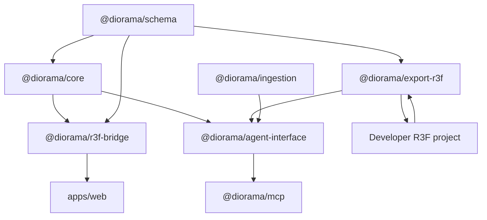

# Architecture Overview

Diorama separates canonical scene state, runtime projection, and generated code.
Its MVP is a local live-sync loop for React Three Fiber projects.

## Product Boundary

Diorama is a visual runtime orchestration layer for R3F applications. It is not
a renderer, cloud publisher, model generator, browser game engine, or general
3D editor. It operates after assets exist in a developer repository and before
the resulting R3F application is deployed through that repository.

## Source Of Truth

The canonical source of truth is the Zod-validated Diorama scene document:

- `@diorama/schema` defines scene documents, nodes, transforms, asset refs,
  semantics, behaviors, validation, and stable JSON serialization.
- `@diorama/core` applies commands through a pure deterministic reducer.
- Runtime objects, R3F refs, TransformControls state, camera state, command
  timeline UI, and Zustand app state are projections or controls only.

Persistent scene edits must flow through commands:

```text
R3F pointer/transform interaction
  -> @diorama/r3f-bridge command translation
  -> @diorama/core reducer
  -> canonical scene
  -> @diorama/export-r3f generated module
  -> app/runtime refresh
```

## Package Model



## `@diorama/schema`

- Owns the `diorama-scene` document wrapper and scene graph validation.
- Preserves stable node IDs, hierarchy, transforms, visibility, `assetRef`,
  semantic groups, behaviors, and asset records.
- Provides deterministic `serializeScene` and parse/migration helpers.

## `@diorama/core`

- Owns the command union and `applyCommand` reducer.
- Commands include node CRUD, transform updates, semantic metadata,
  `REGISTER_ASSET`, `REPLACE_SCENE`, and selection.
- Core has no React, no Zustand, no file IO, and no R3F refs.

## `@diorama/r3f-bridge`

- Projects canonical scene nodes into R3F groups/components.
- Maintains a runtime node registry keyed by stable Diorama node IDs.
- Translates selection and TransformControls commits into commands.
- Provides inspector helpers derived from schema state.
- Does not own canonical state, write files, or expose runtime refs as
  canonical data.

## `@diorama/export-r3f`

- Emits deterministic R3F fragments/modules from canonical scenes.
- Emits the MVP sync module format with an embedded `dioramaScene` document.
- Parses the embedded scene block back into validated canonical state.
- Does not emit editor-only state, command logs, filesystem paths, or runtime
  refs.

## `apps/web`

- Runtime debug shell: viewport, hierarchy, inspector, code preview, sync
  status, and local GLB registration UI.
- Uses Zustand only for app/view/session state.
- UI interactions dispatch commands or call the bridge; they never rewrite
  `scene.nodes` directly.

## Agent And MCP Surface

The MVP tool surface is intentionally narrow:

- `load_scene`
- `get_scene`
- `register_asset`
- `update_transform`
- `export_r3f`
- `sync_code`

MCP and agent tools wrap the same command/export paths. They must not expose
shell execution, arbitrary filesystem browsing, JavaScript evaluation, Zustand
state, or R3F objects.

## Deferred Packages

`@diorama/generation` and `@diorama/generation-meshy` are retained only as
deferred historical experiments. They are not part of the runtime-sync MVP and
must not be exposed through MVP bridge or MCP tools.
